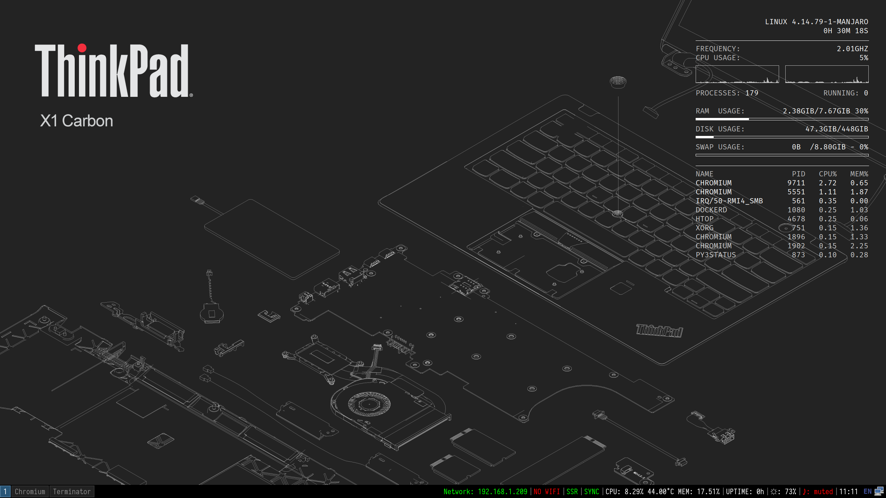
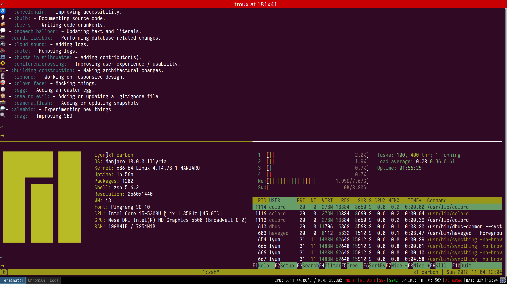

# 明城的 i3wm 环境配置



<!-- TOC -->

- [简介](#简介)
- [安装软件](#安装软件)
- [配置项](#配置项)
    - [自动锁定](#自动锁定)
    - [电源管理和网络管理](#电源管理和网络管理)
    - [CapsLock](#capslock)
    - [Conky](#conky)
    - [剪贴板管理](#剪贴板管理)
    - [鼠标加速度](#鼠标加速度)
    - [Apple 蓝牙键盘的支持](#apple-蓝牙键盘的支持)
    - [Apple Color Emoji](#apple-color-emoji)

<!-- /TOC -->

## 简介

您好，这里是明城的 Linux 图形配置文件列表，这里包括了 `i3wm`、xorg 相关的配置。由于都是出于需求出发，这里可能没有美化相关的配置，所以看起来会「很丑」。

图形界面下，搭配的窗口管理器使用的是 `i3wm` 以及 `mate` 相关的些工具保证基本的操作(例如锁屏、电源、网络管理等)，桌面信息使用 `conkey` 。


## 安装软件

安装必要的 xorg 相关、以及 i3wm 相关的必要软件包:

```bash
sudo pacman -S i3-wm i3lock py3status rofi clipmenu conky awk
sudo pacman -S xorg-xsetroot xorg-xinput xorg-xwininfo xorg-xbacklight
sudo pacman -S xclip xsel xautolock
sudo pacman -S mate-power-manager mate-system-monitor dunst
```

后记，i3wm 目前还是有很多的问题（例如 Tray 的图标无法更新等），使用过以后还是使用了 `i3-gaps` 软件包，同时安装 `i3lock-fancy` 等相关的增强包。

```
yay -S i3-gaps i3lock-fancy-git
```

注意，`i3-gaps` 和 `i3wm` 有冲突，安装 `i3-gaps` 之前先删除 `i3wm` 的软脚包。

py3status 获取系统信息需要额外的 Python 模块，因此都需要安装上:

```bash
pip3 install pydbus pytz tzlocal
```


## 配置项

具体的配置项目在各个目录以及文件中都有说明，这里不再复述。下面只列举比较常见的解决方案。

### 自动锁定

需要使用 xautolock 以及 i3lock 的相互配合，后期使用了 i3lock-fancy 的软件包，相比黑屏的 i3lock 视觉效果上会好很多（但是启动时间比较慢）。

原理方面，使用 xautolock 自动配置 lock 时间以及对应的命令调用 i3lock，然后当需要直接锁定的以后，调用 `xautolock -locknow` 即可。

使用休眠以后自动锁定，使用 xautolock 这个 service，参见配置文件中 `systemd/xautolock@.service` 这个文件。

### 电源管理和网络管理

基本上都使用了 mate 模块里面的对应包(`mate-power-manager`、`nm-applet`)，使用 mate 是因为包的依赖比较少同时能够提供完整而且简单的功能。

### CapsLock

将 Capslock 这个键位映射成了 Ctrl，详细可参见 Xmodmap 文件。

### Conky

增加了 Conky 相关的桌面显示信息插件，配置文件在 `config/conky/conky.conf` 这个路径中v。

### 剪贴板管理

剪贴板历史使用 ClipMenu + rofi 方案，详细可以在对应的 Arch Wiki 上找到。 https://wiki.archlinux.org/index.php/clipboard

### 鼠标加速度

因为个人习惯，默认去除了鼠标和触摸板的加速度，可以在 i3wm 的主配置中修改。建议在其它环境下(例如 GNOME)配置好比较输入的参数，然后获取以后粘贴到 i3wm 的配置中。我的 Thinkpad Carbon 3rd 分别有触控板以及指点杆(小红点)，因此要分别分开配置。

### Apple 蓝牙键盘的支持

参考 Arch 对应的 Wiki 设置以及打开对应的服务(不要忘记 BIOS 里面设置)：

- https://wiki.archlinux.org/index.php/Bluetooth
- https://wiki.archlinux.org/index.php/Bluetooth_keyboard

然后使用 `bluetoothctl` 配对对应的设备后，使用 Blueman 打开自动连接。

由于 Apple 的无线键盘对应的 Win 键和 Thinkpad 对应的键位有所不同，因此采取的方案是将 Apple 对应的键位和笔记本的保持一致。

```bash
setxkbmap -layout us -option altwin:swap_alt_win -device 15
```

PS，`-device <id>` 可以通过 `xinput list` 得出。


### Apple Color Emoji



因为项目本身使用了 gitmoji 等插件，所以需要终端以及网页显示 emoji。配置文件在 `config/fontconfig` 目录下。其实 Arch 下有很多 Emoji 的方案，但是我个人还是使用了 macOS 的 Apple Color Emoji 。

原因主要有两点，一来是苹果的 Emoji 比较全二来显示方面能够和 macOS 保持一致。注意:单独使用 Apple Color Emoji 在其它非 Apple 设备以及系统，可能在版权方面会有问题，哪怕已经拥有了台 Mac。

`- eof -`
