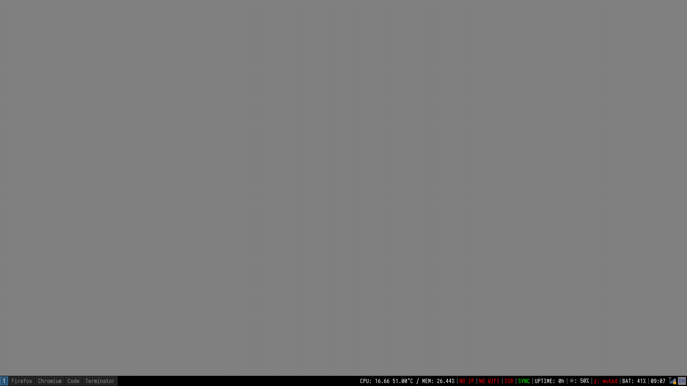

# 明城的 i3wm 环境配置

<!-- TOC depthfrom:2 -->

- [简介](#%E7%AE%80%E4%BB%8B)
- [环境介绍](#%E7%8E%AF%E5%A2%83%E4%BB%8B%E7%BB%8D)
- [安装软件](#%E5%AE%89%E8%A3%85%E8%BD%AF%E4%BB%B6)
- [配置项](#%E9%85%8D%E7%BD%AE%E9%A1%B9)
    - [自动锁定](#%E8%87%AA%E5%8A%A8%E9%94%81%E5%AE%9A)
    - [电源管理和网络管理](#%E7%94%B5%E6%BA%90%E7%AE%A1%E7%90%86%E5%92%8C%E7%BD%91%E7%BB%9C%E7%AE%A1%E7%90%86)
    - [CapsLock](#capslock)
    - [剪贴板管理](#%E5%89%AA%E8%B4%B4%E6%9D%BF%E7%AE%A1%E7%90%86)
    - [鼠标加速度](#%E9%BC%A0%E6%A0%87%E5%8A%A0%E9%80%9F%E5%BA%A6)
    - [Apple Color Emoji](#apple-color-emoji)

<!-- /TOC -->



## 简介

您好，这里是明城的 Linux 图形配置文件列表，这里包括了 `i3wm`、xorg 相关的配置。抱歉，由于都是出于需求出发(主要是开发)，因此这里可能没有美化相关的配置，所以看起来会「很丑」。

图形界面下，搭配的窗口管理器使用的是 i3wm 以及 xfce4 相关的些工具保证基本的操作(例如电源管理、网络管理等)。不要过于折腾 Linux 的图形环境，应该将更多的精力花在更有意义的事情上面(哪怕是发呆)。

## 环境介绍

目前（202012）硬件方面使用的是 PixelBook Go，同时安装的 Linux 发行版为 ArchLinux。基础mate

## 安装软件

安装必要的 xorg 相关、以及 i3wm 相关的必要软件包:

```bash
sudo pacman -S i3-wm py3status rofi clipmenu
sudo pacman -S xorg-xsetroot xorg-xinput xorg-xbacklight xclip xsel xautolock
sudo pacman -S mate-power-manager mate-system-monitor dunst
```

<del>i3wm 目前还是有很多的问题，使用过以后还是使用了 i3-gaps 软件包，同时安装 i3lock-fancy 等相关的增强包。</del>（后记，Archlinux 使用最新的 i3 软件包已经没有对应的问题）

```
yay -S i3-gaps i3lock-fancy-git
```

因为 py3status 获取系统信息需要额外的 Python 模块，因此都需要安装上:

```bash
pip3 install pydbus pytz tzlocal
```

这样子软件包就安装好了。在 Archlinux 下，可以使用对应的 python 系列软件包安装：

```bash
pacman -S python-tzlocal python-pytz
```


## 配置项

具体的配置项目在各个目录以及文件中都有说明，这里不再复述。下面只列举比较常见的解决方案。

### 自动锁定

需要使用 xautolock 以及 i3lock 的相互配合，后期使用了 i3lock-fancy 的软件包，相比黑屏的 i3lock 视觉效果上会好很多。

休眠以后自动锁定，使用 i3lock 这个 service，参见配置文件中 `config/i3/i3lock@.service` 这个文件。

### 电源管理和网络管理

基本上都使用了 mate 模块里面的对应包(`mate-power-manager`、`nm-applet`)，使用 mate 是因为包的依赖比较少同时能够提供完整而且简单的功能。

注意，调用 xfce4-power-manager 的时候，会使用 xfce4 自己原生的锁屏因此需要配置取消锁屏的选项框。后续在 Archliux 中已经不使用对应的图形化电源管理前端，而只是使用 logind 加上 tlp 即可。

hibernate 状态下需要大于内存容量的 swap 分区，因此务必在安装的时候不要忘记。


### CapsLock

将 Capslock 这个键位映射成了 Ctrl，详细可参见 Xmodmap 文件。注意：针对 PixelBook 会有部分键位映射更新，具体参考文件中的内容。

### 剪贴板管理

剪贴板历史使用 ClipMenu + rofi 方案，详细可以在对应的 Arch Wiki 上找到。

### 鼠标加速度

*注意：这段内容主要是针对 Thinkpad 以及指点杆的配置，由于硬件的更新后续已经不再更新。*

因为个人习惯，默认去除了鼠标和触摸板的加速度，可以在 i3wm 的主配置中修改。建议在其它环境下(例如 GNOME)配置好比较输入的参数，然后获取以后粘贴到 i3wm 的配置中。

我的对应的配置文件如下：

```
# @see https://wiki.archlinux.org/index.php/Mouse_acceleration
exec --no-startup-id xinput --set-prop 'TPPS/2 IBM TrackPoint' 'libinput Accel Speed' -0.6
exec --no-startup-id xinput --set-prop 'TPPS/2 IBM TrackPoint' 'libinput Accel Speed Default' 0
#xinput --set-prop 'TPPS/2 IBM TrackPoint' 'libinput Accel Profiles Available' 1, 1
exec --no-startup-id xinput --set-prop 'TPPS/2 IBM TrackPoint' 'libinput Accel Profile Enabled' 1, 0
exec --no-startup-id xinput --set-prop 'TPPS/2 IBM TrackPoint' 'libinput Accel Profile Enabled Default' 1, 0

exec --no-startup-id xinput --set-prop 'Synaptics TM3072-003' 'libinput Tapping Enabled' 1
exec --no-startup-id xinput --set-prop 'Synamateptics TM3072-003' 'libinput Accel Speed' -0.22
exec --no-startup-id xinput --set-prop 'Synaptics TM3072-003' 'libinput Click Methods Available' 1, 1
exec --no-startup-id xinput --set-prop 'Synaptics TM3072-003' 'libinput Click Method Enabled' 0, 1
exec --no-startup-id xinput --set-prop 'Synaptics TM3072-003' 'Coordinate Transformation Matrix' 1.0, 0.0, 0.0, 0.0, 1.0, 0.0, 0.0, 0.0, 1.0
```

因为我的 Thinkpad Carbon 3rd 分别有触控板以及指点杆(小红点)，因此要分别分开配置。

### Apple Color Emoji


因为项目本身使用了 gitmoji 等插件，所以需要终端以及网页显示 emoji。配置文件在 `config/fontconfig` 目录下。其实 Arch 下有很多 Emoji 的方案，但是我个人还是使用了 macOS 的 Apple Color Emoji 。原因主要有两点，一来是苹果的 Emoji 比较全二来显示方面能够和 macOS 保持一致。

注意:单独使用 Apple Color Emoji 在其它非 Apple 设备以及系统，可能在版权方面会有问题，哪怕已经拥有了台 Mac。

`- eof -`